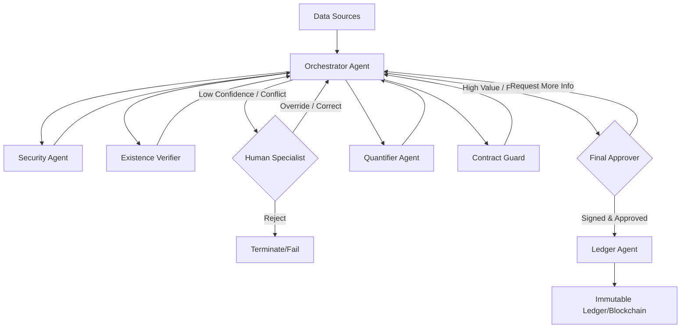

# dMRV Platform Architecture: Secure, Real-time & Anti-Double Claiming

## 1. System Overview
แพลตฟอร์ม dMRV ที่ออกแบบมาเพื่อสร้างความเชื่อมั่นในระดับสูง (High Assurance) โดยใช้ Multi-Agent System ในการตรวจสอบความมีอยู่จริงของทรัพยากรผ่านข้อมูล Multi-modal (IoT, Satellite, Drone, GPS) พร้อมระบบความปลอดภัยขั้นสูง การป้องกันการใช้เครดิตซ้ำ (Double Claiming) และการนำมนุษย์เข้ามาตรวจสอบในขั้นตอนสำคัญ (Human-in-the-Loop) เพื่อความโปร่งใสตามมาตรฐานสากล

---

## 2. Agentic Workflow Design

### 👑 The Orchestrator (Manager Agent)
**บทบาท:** ผู้ควบคุมและตัดสินใจเส้นทางการทำงาน (The Conductor)
- **Workflow Routing:** กำหนดลำดับการทำงานของ Agent และจัดการ Dynamic Routing (เช่น หากข้อมูลไม่ชัดเจน ให้สั่ง Drone บินซ้ำ)
- **State Management:** ถือ `VerificationState` กลาง และส่งต่อข้อมูลที่จำเป็นให้ Agent แต่ละตัวตามหลัก Least Privilege
- **Exception Handling:** จัดการกรณี Error หรือ Low Confidence โดยการส่งต่อให้ Human-in-the-Loop
- **Final Quality Assurance:** ตรวจสอบความครบถ้วนของ Digital Signature จากทุก Agent ก่อนส่งบันทึกลง Ledger

### 🛡️ Layer 1: Ingestion & Security (The Gatekeepers)
- **Security & Classification Agent**: 
    - ตรวจสอบ Integrity (Digital Signature) ของข้อมูลต้นทาง
    - จำแนกชั้นความลับ (Public $\rightarrow$ Confidential $\rightarrow$ Top Secret)
- **Social Impact Agent**:
    - ประเมินผลกระทบทางสังคม (Social Impact Score) โดยคำนวณปัจจัยด้านการจ้างงานท้องถิ่น, การอบรมทักษะ/การศึกษา และการพัฒนาโครงสร้างพื้นฐาน
- **Encryption Agent**: เข้ารหัสข้อมูลทันที (AES-256) และจัดการ Key ผ่าน KMS

### 🔍 Layer 2: Existence & Real-time Verification (The Verifiers)
- **Existence Verifier Agent (Consensus Lead)**: 
    - **Cross-Modal Validation**: ตรวจสอบความสอดคล้องของข้อมูลจาก $\ge 2$ แหล่ง (เช่น Satellite + IoT)
    - **Spatio-Temporal Check**: ยืนยันว่าพิกัด GPS และ Timestamp สัมพันธ์กันจริง
- **Real-time Heartbeat Agent**: ตรวจสอบ Liveness ของอุปกรณ์เพื่อป้องกัน Anti-replay attack

### 📈 Layer 3: Quantification & Contract Enforcement (The Valuators & Arbitrators)
- **Carbon Quantifier Agent**: คำนวณเครดิตตาม Methodology มาตรฐาน (เช่น IPCC) พร้อมประเมินค่า Uncertainty
- **Contract Guard Agent**: 
    - **Right Verification**: ตรวจสอบสิทธิ์เจ้าของตามสัญญา
    - **Double Claiming Prevention**: ตรวจสอบสถานะใน Ledger ว่า Credit ID นี้ถูกใช้ไปแล้วหรือไม่ (Anti-Double Spend)

### ⛓️ Layer 4: Trust, Audit & Reporting (The Archivists)
- **Ledger Agent**: 
    - บันทึก Merkle Root ของหลักฐานทั้งหมดและผลลัพธ์ลงใน Blockchain/Immutable Ledger
    - ทำการ Burn/Retire เครดิตทันทีที่มีการใช้สิทธิ์ เพื่อให้สถานะเป็น Final
- **Reporting Agent**:
    - สรุปผลการประเมินทั้งหมด (Carbon Metrics + Social Impact) ออกมาเป็น Audit Report ในรูปแบบ JSON สำหรับผู้ตรวจสอบ (Auditor)

---

## 3. Human-in-the-Loop (HITL) Integration

ระบบจะไม่ทำงานแบบอัตโนมัติ 100% ในจุดที่มีความเสี่ยงสูง แต่จะใช้มนุษย์ใน 3 กรณี:

1.  **Exception Handler**: เมื่อ Orchestrator พบข้อมูลขัดแย้งกัน (Conflict) หรือ Confidence Score ต่ำกว่าเกณฑ์ จะส่ง "Alert Ticket" ให้ผู้เชี่ยวชาญตัดสินใจ Override
2.  **Final Sign-off**: ก่อนการ Issue หรือ Retire เครดิตมูลค่าสูง ต้องมีการกด Approve จาก Human Auditor เพื่อยืนยันความถูกต้องขั้นสุดท้าย
3.  **Ground-Truth Validator**: การสุ่มตรวจพื้นที่จริงโดยมนุษย์ (Random Audit) เพื่อ Re-calibrate ความแม่นยำของ Agent

---

## 4. Data Flow & Logic

---

## 5. Technical Specification

### Data Schema
- **Evidence Layer (`SourceEvidence`)**: `source_id`, `type`, `timestamp`, `gps_coord`, `payload`, `checksum`
- **Process Layer (`VerificationState`)**: `project_id`, `verified_sources`, `existence_confirmed`, `carbon_amount`, `security_level`, `audit_trail`
- **Settlement Layer (`CarbonCreditToken`)**: `tx_id`, `token_id`, `project_id`, `amount`, `status` (`Available`/`Retired`), `evidence_root`

### Verification Logic
- **Multi-Source Consensus**: ต้องได้รับการยืนยันจาก $\ge 2$ แหล่งที่ต่างประเภทกัน (Unique Source Types)
- **State Machine**: `Issued` $\rightarrow$ `Verified` $\rightarrow$ `Pending_Human` $\rightarrow$ `Claimed` $\rightarrow$ `Retired`

---

## 7. Modular Logistical Integration (`LogisticsModule`)

เพื่อรองรับการจัดการข้อมูลโลจิสติกส์จริง (Physical Logistics) ระบบได้เพิ่ม `LogisticsModule` แบบแยกส่วน (Decoupled Module) โดยเชื่อมต่อผ่าน API interface เพื่อให้การจัดการ asset tracking, inventory และ settlement เป็นไปอย่างอิสระจาก Agentic core

### Logistical Components
- **Tracking Service**: ติดตามตำแหน่ง Real-time ของ Asset/IoT
- **Inventory Service**: จัดการ Ledger ของสินค้า/ทรัพยากร
- **Settlement Service**: ประมวลผลการออกเครดิตตามผลลัพธ์ของกิจกรรมโลจิสติกส์

### API Interface
Core Orchestrator สามารถเรียกใช้งานผ่านฟังก์ชัน:
`logistics.process_request(service, action, **kwargs)`
- ช่วยให้ระบบหลักสามารถดึงข้อมูลสถานะโลจิสติกส์ได้โดยไม่ต้องแก้โครงสร้าง Agent เดิม

